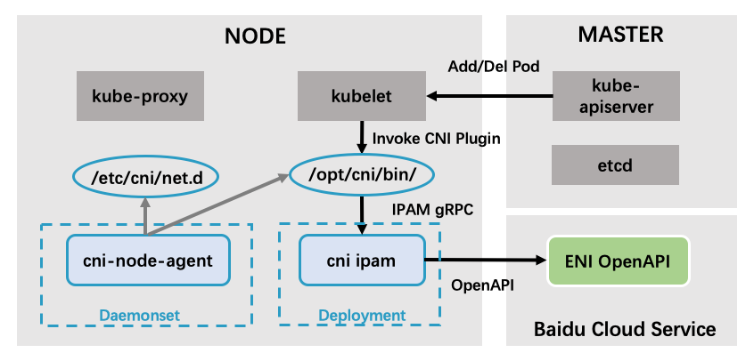

# Baidu Cloud CNI Plugin

English | [简体中文](./README-zh_CN.md)

## Introduction

Baidu Cloud CNI plugin implement an interface between CNI enabled Container
Orchestrator and Baidu Cloud Network Infrastructure.

## Getting Started

These instructions will get you a copy of the project up and running on your environment for development and testing purposes. See installing for notes on how to deploy the project on a [Baidu Cloud CCE](https://cloud.baidu.com/product/cce.html) cluster.

### Prerequisites

A healthy CCE kubernetes cluster. See [documents for creating a CCE cluster](https://cloud.baidu.com/doc/CCE/s/zjxpoqohb).


### Features

From the perspective of Pod connectivity in one node, Baidu Cloud CNI Plugin supports 2 modes:
- veth (compatible with all OS Image)
- ipvlan (need kernel version >= 4.9, e.g., ubuntu16/18 and centos8+)

From the perspective of Pod connectivity across nodes, Baidu Cloud CNI Plugin supports 3 modes:
- VPC Route Mode
- ENI Secondary IP Mode (only for BCC)
- BBC Secondary IP Mode

### Components

There are 3 components:

- CNI Plugin, which will wire up host's and pod's network stack when called.
- Node Agent, which is a long-running daemon on each node responsible for:
  - create cni configuration file in `/etc/cni/net.d/`
  - install cni plugin binaries in `/opt/cni/bin/`
  - setup attached ENIs
  - create VPC route
- ENI IPAM, which is a long-running central process, supports:
  - create and attach ENIs to node
  - assign a Private IP address to a Pod



### Installing


Fill proper information about CCE cluster in `build/yamls/cce-cni-driver/values.yaml` , then run

```
make charts VALUES=build/yamls/cce-cni-driver/values.yaml | kubectl apply -f -
```

Assume we have a CCE cluster with ID `cce-xxxxx` at `bj` region.
Cluster `cce-xxxxx` is in VPC `vpc-yyyyy`.


Example `values.yaml` are shown below:

#### VPC Route Mode

```yaml
CNIMode: vpc-route-auto-detect
Region: bj
ClusterID: cce-xxxxx
VPCID: vpc-yyyyy
ContainerNetworkCIDRIPv4: # cluster container cidr
CCEGatewayEndpoint: cce-gateway.bj.baidubce.com
BCCEndpoint: bcc.bj.baidubce.com
BBCEndpoint: bbc.bj.baidubce.com
ServiceCIDR: # cluster service cidr
CCECNIImage: registry.baidubce.com/cce-plugin-pro/cce-cni:v1.3.2

# Route Controller
EnableVPCRoute: true
EnableStaticRoute: false
```

#### ENI Secondary IP Mode

```yaml
CNIMode: vpc-secondary-ip-auto-detect
Region: bj
ClusterID: cce-xxxxx
VPCID: vpc-yyyyy
ENISubnetList:
  - sbn-a
  - sbn-b
SecurityGroupList:
  - g-bwswsr8fbjb4
CCEGatewayEndpoint: cce-gateway.bj.baidubce.com
BCCEndpoint: bcc.bj.baidubce.com
BBCEndpoint: bbc.bj.baidubce.com
ServiceCIDR: # cluster service cidr
CCECNIImage: registry.baidubce.com/cce-plugin-pro/cce-cni:v1.3.2
```

#### BBC Secondary IP Mode

```yaml
CNIMode: bbc-vpc-secondary-ip-auto-detect
Region: bj
ClusterID: cce-xxxxx
VPCID: vpc-yyyyy
CCEGatewayEndpoint: cce-gateway.bj.baidubce.com
BCCEndpoint: bcc.bj.baidubce.com
BBCEndpoint: bbc.bj.baidubce.com
ServiceCIDR: # cluster service cidr
CCECNIImage: registry.baidubce.com/cce-plugin-pro/cce-cni:v1.3.2
```

For more details, check [values.yaml](build/yamls/cce-cni-driver/values.yaml).

## Running the tests

### Unit Test

```
make test
```

## Contributing

Please go through [CNI Spec](https://github.com/containernetworking/cni/blob/master/SPEC.md) to get some basic understanding of CNI driver before you start.

### Requirements
* Golang 1.13.+
* Docker 17.05+ for releasing

### Dependency
Dependencies are managed through go module.

### Build
To build the project, first turn on go mod using `export GO111MODULE=on`.

To build all the binary, run `make build`, then build the docker image using: `make cni-image`.

### Issues

* Please create an issue in issue list.
* Contact Committers/Owners for further discussion if needed.

## Authors

* Maintainers: chenyaqi01@baidu.com, jichao04@baidu.com

## Discussion

* Issue list.
* Ruliu Group ID: 1586317
