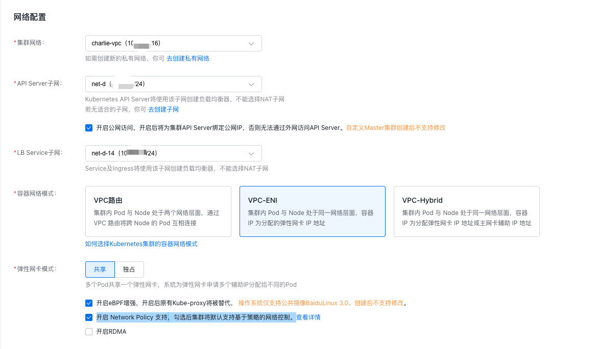

# cce-network-v2 2.9.x 使用 cilium tc service配置文档
## 1. 概述
本文档介绍了 cce-network-v2 2.9.x 使用 cilium tc service 的配置文档。文档从创建集群,到修改容器网络相关配置，提供了一个完整的操作指引。

## 2. 运行环境
- 操作系统: BaiduLinux 3.0 x86_64 (64bit)
- 内核版本: 5.10 内核
- k8s 版本: v1.24.4
- containerd 版本: v1.6.20
- 容器网络配置：
  - 模式：VPC-ENI
  - 版本：2.9.1
  - 开启eBPF增强，开启后原有Kube-proxy将被替代， 操作系统仅支持公共镜像BaiduLinux 3.0。创建后不支持修改。
  - 开启 Network Policy 支持，勾选后集群将默认支持基于策略的网络控制。

> 以上为本 SOP 文档的验证环境，其他环境可能存在细节差异，但不影响正常使用。

### 2.1 使用限制
* 内核版本要求 5.7 及以上
* 操作系统仅支持公共镜像 BaiduLinux 3.0。创建后不支持修改。

## 3. 操作指引
### 3.1 创建集群
创建集群页面，在容器网络配置中，勾选 eBPF 增强，并开启 Network Policy 支持。



### 3.2 添加节点
添加节点时，请注意节点使用公共镜像 BaiduLinux 3.0。如果使用其他自定义镜像，请在节点添加前校验内核版本。

### 3.3 修改容器网络配置
#### 3.3.1 修改容器网络CNI 模版配置
要使用 cilium tc service，需要修改容器网络CNI 模版配置增加 cilium-cli 插件。下面演示通过 kubectl 修改cni配置文件模板。
```bash
kubectl -n kube-system edit cm cni-config-template
```
修改添加`cilium-cni`插件后，cni-config-template 内容如下：
```yaml
apiVersion: v1
data:
  cce-ptp.template: |
    {
        "name":"generic-veth",
        "cniVersion":"0.4.0",
        "plugins":[
            {
                "type":"cptp",
                "ipam":{
                    "type":"cipam",
                    "min-allocate": 2,
                    "pre-allocate": 2,
                    "max-above-watermark": 2,
                    "eni": {
                        "routeTableOffset": 127
                    },
                    "pod-cidr-allocation-threshold": 1,
                    "pod-cidr-release-threshold": 1
                },
                "mtu": 1500
            }
            ,{
                "type": "endpoint-probe"
            },
            {
                "type": "cilium-cni",
            }
        ]
    }
  primary-eni.temlplate: "{\n    \"name\":\"podlink\",\n    \"cniVersion\":\"0.4.0\",\n
    \   \"plugins\":[\n        {\n            \"type\":\"exclusive-device\",\n            \"ipam\":{\n
    \               \"type\":\"enim\"\n            }\n        }\n    ]\n}        \n"
kind: ConfigMap
metadata:
  labels:
    addonmanager.kubernetes.io/mode: EnsureExists
  name: cni-config-template
  namespace: kube-system
```
* 修改cni `name`字段为 `generic-veth`，否则无法使用。
* 添加`cilium-cni`插件到插件列表。

#### 3.3.2 修改 cilium 配置
完成cce-networ-v2 容器网络配置后，需要修改 cilium 配置。
```bash
kubectl -n kube-system edit cm cilium-config
```

修改后，cilium-config 内容如下：
```yaml
apiVersion: v1
data:
  agent-not-ready-taint-key: node.cilium.io/agent-not-ready
  arping-refresh-period: 30s
  auto-direct-node-routes: "false"
  bpf-lb-external-clusterip: "false"
  bpf-lb-map-max: "65536"

  # - 删除该行
  # bpf-lb-sock: "false"

  # + 添加该行
  bpf-lb-sock: "true"
  bpf-lb-sock-hostns-only: true

  bpf-map-dynamic-size-ratio: "0.0025"
  bpf-policy-map-max: "16384"
  bpf-root: /sys/fs/bpf
  cgroup-root: /run/cilium/cgroupv2
  cilium-endpoint-gc-interval: 5m0s
  cluster-id: "0"
  cluster-name: default
  cni-chaining-mode: generic-veth
  custom-cni-conf: "true"
  debug: "false"
  disable-cnp-status-updates: "true"
  disable-endpoint-crd: "false"
  enable-auto-protect-node-port-range: "true"
  enable-bgp-control-plane: "false"
  enable-bpf-clock-probe: "true"
  enable-endpoint-health-checking: "false"
  enable-endpoint-routes: "true"
  enable-health-check-nodeport: "true"
  enable-health-checking: "false"
  enable-host-legacy-routing: "true"
  enable-ipv4: "true"
  enable-ipv4-masquerade: "false"
  enable-ipv6: "false"
  enable-ipv6-masquerade: "false"
  enable-k8s-terminating-endpoint: "true"
  enable-l2-neigh-discovery: "true"
  enable-l7-proxy: "false"
  enable-local-node-route: "false"
  enable-local-redirect-policy: "false"
  enable-policy: default
  enable-remote-node-identity: "true"
  enable-svc-source-range-check: "true"
  enable-vtep: "false"
  enable-well-known-identities: "false"
  enable-xt-socket-fallback: "true"
  identity-allocation-mode: crd
  install-iptables-rules: "true"
  install-no-conntrack-iptables-rules: "false"
  ipam: kubernetes
  ipv4-native-routing-cidr: 10.0.0.0/16
  kube-proxy-replacement: strict
  kube-proxy-replacement-healthz-bind-address: ""
  local-router-ipv4: 169.254.169.244
  monitor-aggregation: medium
  monitor-aggregation-flags: all
  monitor-aggregation-interval: 5s
  node-port-bind-protection: "true"
  node-port-range: 30000,32768
  nodes-gc-interval: 5m0s
  operator-api-serve-addr: 127.0.0.1:9234
  preallocate-bpf-maps: "false"
  procfs: /host/proc
  remove-cilium-node-taints: "true"
  set-cilium-is-up-condition: "true"
  sidecar-istio-proxy-image: cilium/istio_proxy
  skip-cnp-status-startup-clean: "false"
  synchronize-k8s-nodes: "true"
  tofqdns-dns-reject-response-code: refused
  tofqdns-enable-dns-compression: "true"
  tofqdns-endpoint-max-ip-per-hostname: "50"
  tofqdns-idle-connection-grace-period: 0s
  tofqdns-max-deferred-connection-deletes: "10000"
  tofqdns-min-ttl: "3600"
  tofqdns-proxy-response-max-delay: 100ms
  tunnel: disabled
  unmanaged-pod-watcher-interval: "0"
  vtep-cidr: ""
  vtep-endpoint: ""
  vtep-mac: ""
  vtep-mask: ""
kind: ConfigMap
metadata:
  name: cilium-config
  namespace: kube-system
```

修改完成之后，需要重启 cilium 组件。

#### 3.3.3 可选其它网络配置
服务网络负载均衡包含了一套复杂的控制策略，下面概要介绍几个关键的配置。

##### 3.3.3.1 负载均衡算法配置
cilium 默认使用 `random` 算法，可以通过 `` 按需修改。各个算法介绍如下：
- `random`：随机算法，默认使用。
- `maglev`：Maglev 算法，节点无需关注其他客户端节点状态，根据 5 元组选择后端 rs，在故障恢复时有更好的性能表现。
    - 删除后端后，最多造成 1%的重新编程干扰。
    - `maglev.tableSize`: 默认 16381，Maglev 算法表大小，建议值大于 100 * rs 修改。使用更大的表可以减少 hash 冲突，但也会增加内存占用。
### 3.4 重启网络组件
重启cilium 和 cce-network-agent 组件，使配置更新生效。
```bash
kubectl -n kube-system rollout restart ds/cilium
kubectl -n kube-system rollout restart ds/cce-network-agent
```

#### 3.4.1 验证网络组件
查看 cilium 组件状态，确认 `cilium-agent` 已经修改为 tc 的工作模式。