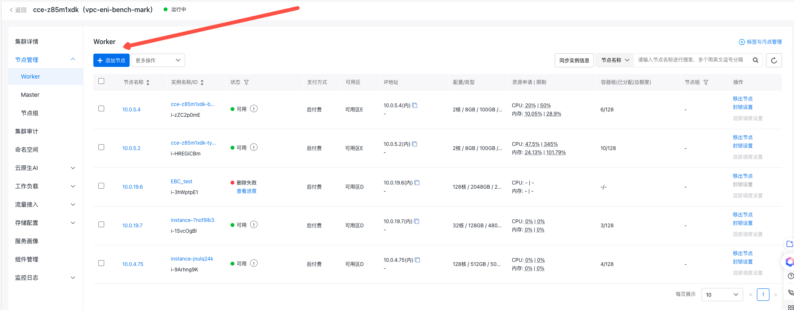
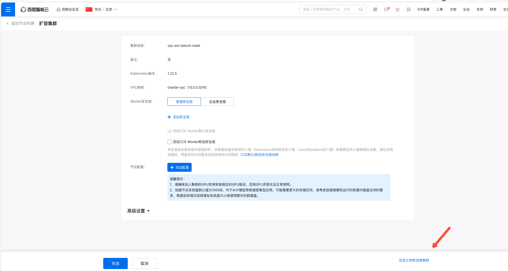
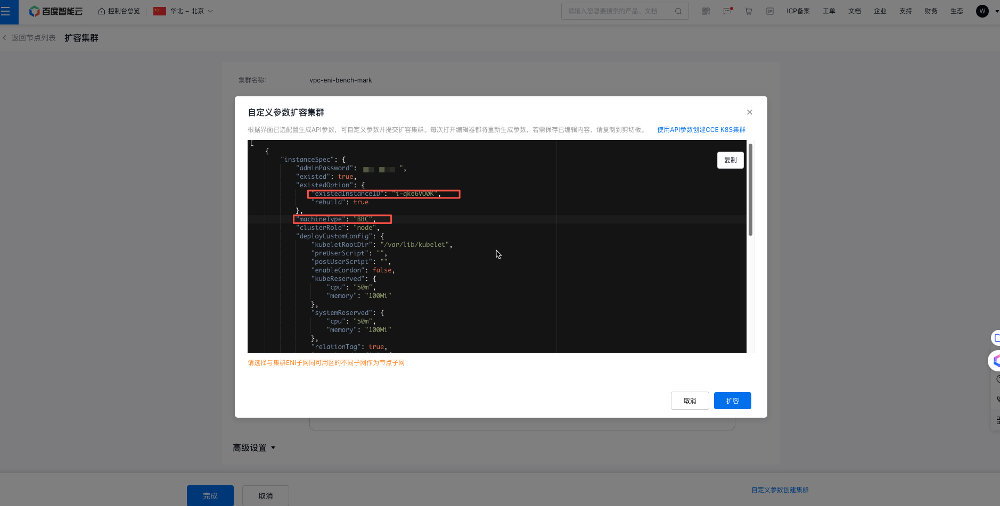

# VPC-ENI 集群添加 BBC 节点操作案例
## 1. 背景信息
本案例介绍如何添加一个 VPC-ENI 集群的 BBC 节点。在 CCE 限制内，通过自定义参数扩容集群的方法，将 BBC 节点添加到集群中。
### 1.1 使用限制
* 请确认已有节点和集群在同一个 VPC 中。
* 请确认已有节点所在的子网有足够的空闲 IP 资源，请提前做好资源规划。
    * 加入到 CCE 集群的 BBC 节点最多需要分配 40 个 IP 地址
    * BBC 节点最大仅允许创建 39 个使用独立 IP 地址的容器
* 一个计算实例最多只能加入一个集群。移除集群后，建议重装操作系统以清理相关残留配置。
* 请确认在节点加入集群前已经完成了重装操作系统操作，推荐内核版本为 5.7 以上。
## 2. 操作步骤
### 2.1 CCE 集群添加节点
请进入 CCE 控制台，在集群列表中，找到目标集群，点击集群名称，进入集群节点管理页面。

### 2.2 使用自定义参数扩容集群
点击“使用自定义参数扩容集群”链接，进入自定义参数扩容集群页面。

接着会自动弹出出入框，请将以下内容复制到输入框中。


### 2.3 自定义参数扩容集群
在自定义参数扩容集群的输入框中，可以通过以下内容模板，替换关键的实例名和密码信息，将已有的 BBC 节点添加到集群中。

```json
[
	{
		"instanceSpec": {
			"adminPassword": "***",
			"existed": true,
			"existedOption": {
				"existedInstanceID": "i-qke6VO0K",
				"rebuild": false
			},
			"machineType": "BBC",
			"clusterRole": "node",
			"deployCustomConfig": {
				"kubeletRootDir": "/var/lib/kubelet",
				"preUserScript": "",
				"postUserScript": "",
				"enableCordon": false,
				"kubeReserved": {
					"cpu": "50m",
					"memory": "100Mi"
				},
				"systemReserved": {
					"cpu": "50m",
					"memory": "100Mi"
				},
				"relationTag": true,
				"containerdConfig": {
					"dataRoot": "/home/cce/containerd"
				}
			},
			"instanceResource": {
				"cdsList": []
			},
			"vpcConfig": {
				"securityGroupType": "normal",
				"securityGroup": {
					"customSecurityGroups": [],
					"enableCCERequiredSecurityGroup": true,
					"enableCCEOptionalSecurityGroup": false
				}
			},
			"labels": {
				"cce.baidubce.com/gpu-share-device-plugin": "disable",
				"cce.baidubce.com/baidu-cgpu-priority": "false"
			},
			"tags": [],
			"taints": [],
			"relationTag": true,
			"instanceOS": {
				"imageType": "System"
			},
		}
	}
]
```

上述模板中，需要替换的关键信息如下：
* `adminPassword`: 必须字段。主机密码，请使用符合密码规则的字符串。如果密码不正确，会导致主机无法加入集群。
* `existedInstanceID`: 必须字段。待加入集群的节点 ID。请在 弹性裸金属服务器 -> 控制台 -> 实例列表 中，找到待加入集群的节点 ID。
* `taints`: 可选字段。节点污点标签，请根据需要填写。
* `labels`: 可选字段。节点标签，请根据需要填写。
* `deployCustomConfig`: 可选字段。节点自定义配置，请根据需要填写。
