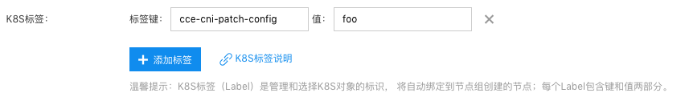

# CCE CNI NodeAgent 使用节点配置派生


## 默认配置

CCE CNI NodeAgent 依赖一个配置文件读取用户传递的容器网络相关参数，配置文件以 `ConfigMap` [资源对象](../build/yamls/cce-cni-driver/templates/configmap.yaml)的形式存在于集群中，默认的 `ConfigMap` 配置文件名 `cce-cni-node-agent`。

该 ConfigMap 将挂载入 CNI NodeAgent 的 Pod 中，并在 agent 启动时读取。下文中将其称为**默认配置**。

执行 `kubectl get cm -n kube-system cce-cni-node-agent -o yaml` 可以看到默认配置的详细内容。

一个配置文件样例：
```yaml
cniMode: vpc-secondary-ip-auto-detect
cce:
  region: bd
  clusterID: cce-xxx
  vpcID: vpc-xxxx
  eniController:
    eniSubnetList:
      - sbn-aaaa
      - sbn-bbbb
    securityGroupList:
      - g-gggg
```

## 使用配置派生

在默认配置之上， CCE CNI 还允许通过 `label` 为单个节点指定派生配置文件的功能。

用户需要在 node 标签中加入：
```
cce-cni-patch-config: <config_name>
```

NodeAgent 在启动时会通过如上标签名获得派生配置文件名，并获取 kube-system 命名空间下的 ConfigMap: <config_name> 并以 key `config` 作为派生配置内容。

获取到的该派生配置将会以[MergePatch](https://datatracker.ietf.org/doc/html/rfc7396)的形式合并到默认配置上。

例如希望给指定新的 ENI 子网且改变容器网络模式，则需要给 node 打上 label `cce-cni-patch-config: eni-patch-config`，并提交如下派生配置的 ConfigMap yaml:
```yaml
apiVersion: v1
kind: ConfigMap
metadata:
  name: eni-patch-config
  namespace: kube-system
data:
  config: |
    cniMode: vpc-secondary-ip-ipvlan
    cce:
      eniController:
        eniSubnetList:
          - sbn-cccc
```

在上述默认配置的基础上，则 NodeAgent 最终读取的配置为:
```yaml
cniMode: vpc-secondary-ip-ipvlan
cce:
  region: bd
  clusterID: cce-xxx
  vpcID: vpc-xxxx
  eniController:
    eniSubnetList:
    - sbn-cccc
    securityGroupList:
    - g-gggg
```


> 注意：若在现有节点上设置或更换派生配置，需要对 NodeAgent 进行重启才能够应用。并且之前已经申请到的网络资源（如 ENI、IP 等），可能仍旧会保留在 CNI 组件中。

## 关于合并配置

CCE CNI 使用了 [json-patch](https://github.com/evanphx/json-patch) 库来对配置进行合并，其实现了 RFC7396 中声明的 [MergePatch](https://datatracker.ietf.org/doc/html/rfc7396) 过程。

一个简单的合并样例，对于如下的 json：
```json
{
	"a": "b",
	"c": {
		"d": "e",
		"f": "g"
	}
}
```

应用以下 patch：
```json
{
	"a":"z",
	"c": {
		"f": null
	}
}
```

这会将 "a "的值更改为 "z" 并删除键 "f"，最终的合并结果：
```json
{
    "a":"z",
    "c":{
        "d":"e"
    }
}
```

## 更多样例

### BBC 主网卡辅助 IP 模式 node 粒度指定容器子网

**用户需求**：用户在使用 VPC-Hybrid 网络模式集群时，期望集群中新增的部分节点可以指定容器 IP 的来源子网。
**参考步骤**：

1. 在集群中提交派生配置的 patch yaml，指明容器子网来自 sbn-xxxx 。

```yaml
apiVersion: v1
kind: ConfigMap
metadata:
  name: foo
  namespace: kube-system
data:
  config: |
    cce:
      podSubnetController:
        subnetList:
          - sbn-xxxx
```

2. CCE 控制台创建节点组，节点的 k8s label 加上:  `cce-cni-patch-config=foo`

3. 对创建的节点组进行扩容，扩容出的节点上容器会使用子网 sbn-xxxx 中的 IP。