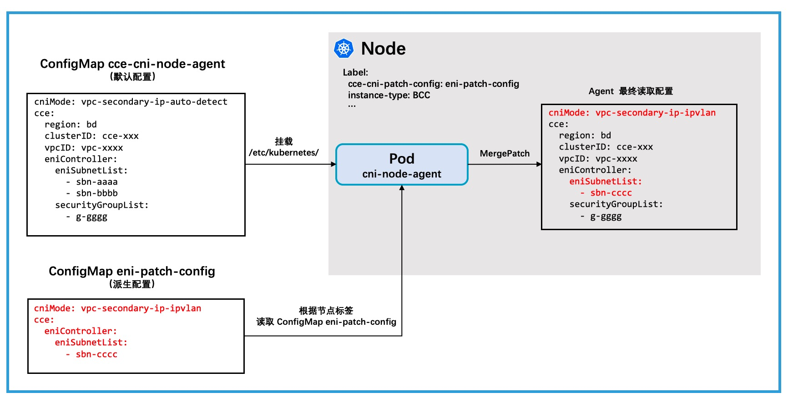

# CCE CNI NodeAgent 使用节点配置派生


## 默认配置

CCE CNI NodeAgent 依赖一个配置文件读取用户传递的容器网络相关参数，配置文件以 `ConfigMap` [资源对象](../build/yamls/cce-cni-driver/templates/configmap.yaml)的形式存在于集群中，默认的 `ConfigMap` 配置文件名 `cce-cni-node-agent`。

该 ConfigMap 将挂载入 CNI NodeAgent 的 Pod 中，并在 agent 启动时读取。下文中将其称为**默认配置**。

执行 `kubectl get cm -n kube-system cce-cni-node-agent -o yaml` 可以看到默认配置的详细内容。

一个配置文件样例：
```yaml
cniMode: vpc-secondary-ip-auto-detect
cce:
  region: bd
  clusterID: cce-xxx
  vpcID: vpc-xxxx
  eniController:
    eniSubnetList:
      - sbn-aaaa
      - sbn-bbbb
    securityGroupList:
      - g-gggg
```

## 使用配置派生

在默认配置之上， CCE CNI 还允许通过 `label` 为单个节点指定派生配置文件的功能。

用户需要在 node 标签中加入：
```
cce-cni-patch-config: <config_name>
```

agent 在启动时会通过如上标签名获得派生配置文件名，并获取 kube-system 命名空间下的 ConfigMap: <config_name> 并以 key `config` 作为派生配置内容。

获取到的该派生配置将会以[MergePatch](https://datatracker.ietf.org/doc/html/rfc7396)的形式合并到默认配置上。

例如希望给指定新的 ENI 子网且改变容器网络模式，则需要给 node 打上 label `cce-cni-patch-config: eni-patch-config`，并提交如下派生配置的 ConfigMap yaml:
```yaml
apiVersion: v1
kind: ConfigMap
metadata:
  name: eni-patch-config
  namespace: kube-system
data:
  config: |
    cniMode: vpc-secondary-ip-ipvlan
    cce:
      eniController:
        eniSubnetList:
          - sbn-cccc
```

在上述默认配置的基础上，则 agent 最终读取的配置为:
```yaml
cniMode: vpc-secondary-ip-ipvlan
cce:
  region: bd
  clusterID: cce-xxx
  vpcID: vpc-xxxx
  eniController:
    eniSubnetList:
    - sbn-cccc
    securityGroupList:
    - g-gggg
```



> 注意：若在现有节点上设置或更换动态配置，需要对 agent 进行重启才能够应用

## 关于合并配置

CCE CNI 使用了 [json-patch](https://github.com/evanphx/json-patch) 库来对配置进行合并，其实现了 RFC7396 中声明的 [MergePatch](https://datatracker.ietf.org/doc/html/rfc7396) 过程。

一个简单的合并样例，对于如下的 json：
```json
{
	"a": "b",
	"c": {
		"d": "e",
		"f": "g"
	}
}
```

应用以下 patch：
```json
{
	"a":"z",
	"c": {
		"f": null
	}
}
```

这会将 "a "的值更改为 "z" 并删除键 "f"，最终的合并结果：
```json
{
    "a":"z",
    "c":{
        "d":"e"
    }
}
```

## 更多样例

### 1 预分配辅助 IP 模式与 VPC 路由模式混合

用户在参考 [CCE CNI 使用预分配辅助 IP 模式](deploy-with-pre-allocated-ip.md) 说明后，期望自建集群中部分节点可以混布使用 VPC 路由的模式。

可参考如下操作步骤：

1. 确保使用 VPC 路由模式的 node 中 `.spec.podCIDR` 字段非空且是期望的容器网段；
2. 给使用 VPC 路由模式的 node 打上 label
```
kubectl label node xxxx cce-cni-patch-config=route-mode
```
3. 提交如下 yaml
```yaml
apiVersion: v1
kind: ConfigMap
metadata:
  name: route-mode
  namespace: kube-system
data:
  config: |
    cniMode: vpc-route-ipvlan
    cce:
      accessKeyID: <ak>
      secretAccessKey: <sk>
```