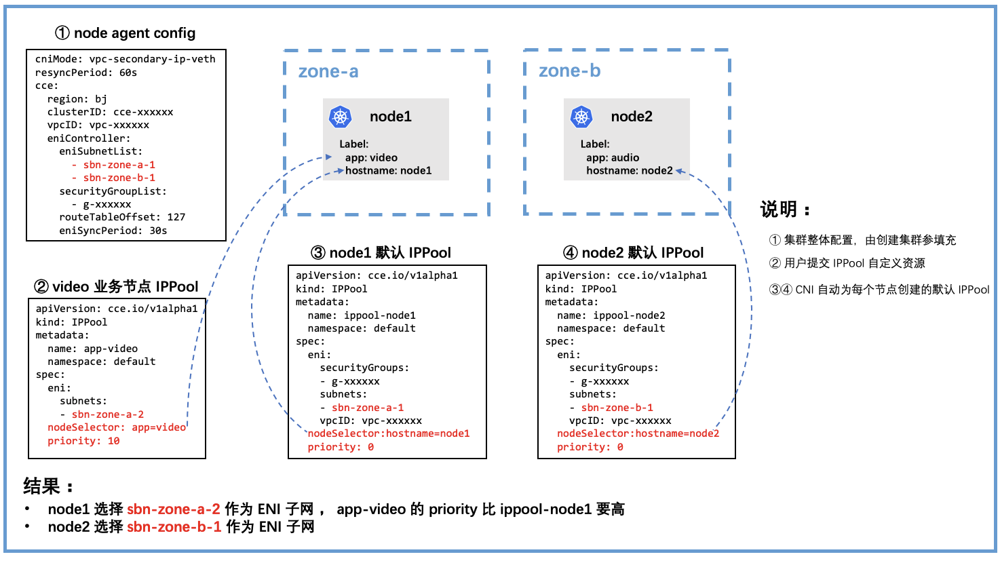

# 动态配置

## 背景介绍

CCE CNI 依赖一个配置文件提供创建 ENI 的参数，例如子网、安全组。

该配置文件的内容来自用户创建集群时选择的参数，并且以一个 ConfigMap 资源对象的形式存在于集群中。执行 `kubectl get cm -n kube-system cce-cni-node-agent -o yaml` 可以看到配置文件的详细内容。

一个配置文件样例：
```yaml
cniMode: vpc-secondary-ip-auto-detect
resyncPeriod: 60s
cce:
  region: bd
  clusterID: cce-4978a9dd
  vpcID: vpc-gfbrt20nrnwt
  eniController:
    eniSubnetList:
      - sbn-0yeasaqzrqem
      - sbn-quuhn1ba5m38
    securityGroupList:
      - g-h8h9v0wpbd0x
    routeTableOffset: 127
    eniSyncPeriod: 30s
```

CNI 对于该配置文件的使用方式可以概括如下：

1. 配置文件以 Volume 形式被挂载进 NodeAgent Pod 中，并被 NodeAgent 读取解析；
2. NodeAgent 查找出配置中 `eniSubnetList` 中与本节点同可用区的所有子网；
3. NodeAgent 为本节点创建出一个 IPPool 自定义资源(下文称为节点默认 IPPool)， 并填入第2步中筛选出的同可用区的子网；
4. IPAM 根据 IPPool 中包含的信息去为每个节点创建/挂载 ENI；

一个节点默认 IPPool 自定义资源的样例：
```yaml
apiVersion: cce.io/v1alpha1
kind: IPPool
metadata:
  name: ippool-192-168-0-227
  namespace: default
spec:
  eni:
    securityGroups:
    - g-h8h9v0wpbd0x
    subnets:
    - sbn-0yeasaqzrqem
    vpcID: vpc-gfbrt20nrnwt
  nodeSelector: kubernetes.io/hostname=192.168.0.227
  priority: 0
```
可以注意到，节点默认 IPPool 的 `priority` 为 0，并且 `nodeSelector` 通过节点名称 label 只作用于单个节点。


## 使用说明

在此基础上，CCE CNI 还支持基于节点 label 为单节点指定动态配置文件的功能。结合 CCE 的节点组功能，能够支持节点粒度的网络划分、访问控制等精细化配置。

使用该功能需要 CCE CNI 版本大于 `v1.2.2` 。

一个普遍的使用方式：

1. 用户提交 IPPool 自定义资源，注意 `nodeSelector` 与 `priority` 字段的填写；
2. CCE Console 新建节点组时选择给节点添加标签，与第1步中 `nodeSelector` 匹配；
3. 新加入集群的节点会使用用户提交的 IPPool 自定义资源进行 ENI 的创建、绑定；



图中用户提交的样例 IPPool 自定义资源:
```yaml
apiVersion: cce.io/v1alpha1
kind: IPPool
metadata:
  name: ippool-video
  namespace: default
spec:
  eni:
    subnets:
    - sbn-zone-a-2
  nodeSelector: app=video
  priority: 10
```


> 注：若给已有节点上配置自定义 IPPool，节点上之前已经申请到的相关资源（如ENI等）仍旧会保留在节点上，新申请的资源才会按照自定义 IPPool 进行创建。

**关于 IPPool 匹配规则**

1. 遍历所有 IPPool，选出 `nodeSelector` 能够匹配节点 label 的所有 IPPool；
2. 匹配节点 label 的所有 IPPool 根据 `priority` 从大到小排序；
3. 选出 `priority` 最大的 IPPool 的 `subnets` 作为 ENI 子网，如果存在多个 IPPool 拥有相同且最大的 `priority`，则取它们 `subnets` 的并集；

>  注：`nodeSelector` 的格式与 k8s [label selector](https://kubernetes.io/docs/concepts/overview/working-with-objects/labels/#label-selectors) 完全兼容
